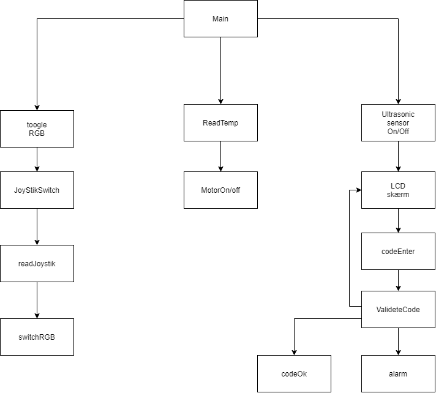
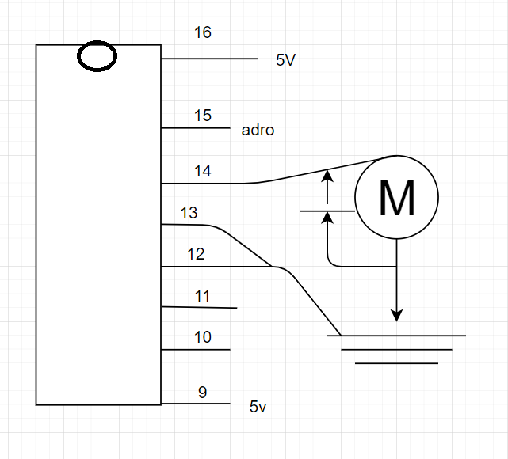
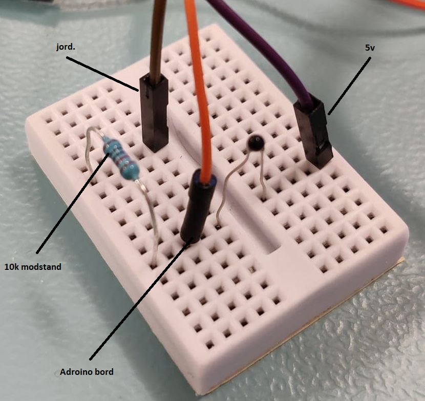

# ProjektSmartHome
 skole projekt Af Casper Wind

I dette projekt skal jeg lave IOT til mit hus.
<ul>
<li>Tempratur måler til soveværlset ✔</li>
<li>RGB lys til børneværlset✔</li>
<li>Kodelås til vinkælderen❌</li>
</ul>

# HIPO diagram.



# Tempratur måler til soveværlset


Den måler tempratueren og starter en fane sår tempratueren kommer over 25 grader.
Og stopper igen når den kommer under 23 grader.

Hvis du ønsker at lave om på hvornår den begynder og stopper så skal det laves om i koden, Fil temp.c

```
if (TempC > 25) // tjekker om tempraturen er over 25 grader. og starter motoren hvis det er over.
	{
		OCR3A = 255;
	}
	if (TempC < 23) // tjekker om tempraturen er under 23 grader og slukker for motoren hvis det er under.
	{
		OCR3A = 0;
	}
```
Den skal lave nogen beregninger for at finde ud af hvad tempraturen er. Den modtaer en ADC fra ``` ISR(ADC_VECT) ``` 

### Opsætning ef tempratur måler og motor.

motoren skal sættes op sådan her.

Nu skal L293D Chip på. Og det er meget VIGTIGT at den vender som den skal. Der er et lille hak øverst på chippen og så er ben nummer 1 til venstre for det hak så kan vi tælle. Der skulle meget gerne være 16 ben. 



Ben 16 til 5v.

Ben 15 til selve ardrorino bordet i dette projekt skal den hen til pin 5.

14 til +siden af motoren og fra motoren til jord. Og imellem motoren og jord skal der en diode som pejer ind mod ben 14.

13 og 12 skal til jord.

11 og 10 skal vi ikke gøre noget med.

Ben 9 til 5v.

### Opsætning af termometer.

termometeret skal sættes op sådan her.



den ledning som skal til adrorino bordet sider i mit projekt i pin A0. det er vigtigt at den sider i en analo port da den sender et analogt signal som skal om regnes til digitalt med en ADC.

det der sker i programmet er at den termimst som sider på bordet. laver en modstand som ADC'en fanger og om regner til tempraturen.