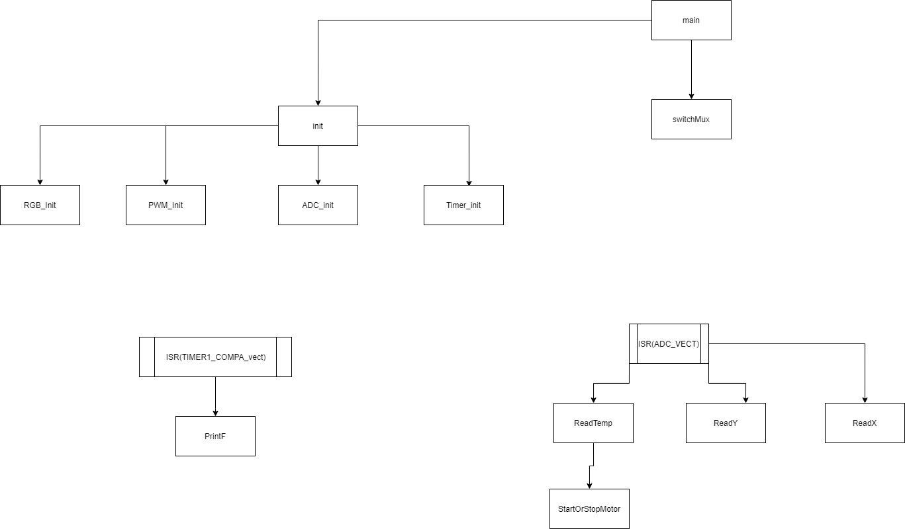

# ProjektSmartHome
 skole projekt Af Casper Wind

I dette projekt skal jeg lave IOT til mit hus.
<ul>
<li>Tempratur måler til soveværlset ✔</li>
<li>RGB lys til børneværlset</li>
<li>Kodelås til vinkælderen</li>
</ul>

#HIPO diagram.
